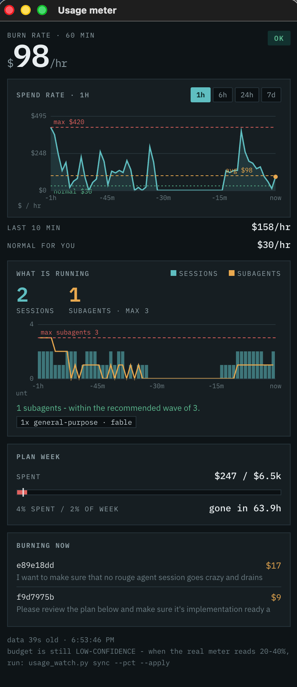

# Claude usage meter

A local watchdog for Claude Code spend. It alerts the moment your burn rate leaves normal
range, names the session causing it, and tells you what to do — plus a floating live meter.

**It makes zero LLM calls.** Pure Python 3 stdlib on a launchd timer, ~0.2s per poll, so
the watchdog can never contribute to the problem it watches.

<p align="center">
  
</p>

## Why it exists

One Claude Code session cost **~$12,700 in 24.9 hours**. Nothing was broken — no bug, no
runaway loop. It did exactly what it was told: *"use multi-agent orchestration, fan out
subagents, one agent per work package."*

Where the money went is the whole lesson:

| line item | cost | share |
|---|---:|---:|
| cache **reads** — re-reading context already sent | $10,168 | **79.8%** |
| cache **writes** | $2,461 | 19.3% |
| **output tokens — every line of code it produced** | **$107** | **0.8%** |
| fresh input | $3 | 0.0% |

You pay almost nothing to think. You pay to **re-read**. A conversation has no memory
between turns, so the entire transcript is re-sent on *every* turn — and above 200k context
it is re-sent at double price. That run averaged 295k re-read tokens across 13,644 calls:
4.03 billion tokens. Multiply by 111 subagents and a normal day becomes a very expensive
one. The over-200k surcharge alone was **45% of the bill**.

## Install

```bash
git clone https://github.com/jachai/claude-usage-meter.git
cd claude-usage-meter
mkdir -p ~/.claude/scripts
cp usage_watch.py usage-meter.command ~/.claude/scripts/
chmod +x ~/.claude/scripts/usage-meter.command
python3 ~/.claude/scripts/usage_watch.py install     # 2 launchd agents, start at login
python3 ~/.claude/scripts/usage_watch.py calibrate   # fit thresholds to YOUR history
```

macOS only as written (launchd + `osascript` notifications). The engine is portable — swap
`install`/`notify` for systemd + `notify-send` on Linux.

## Commands

```bash
usage_watch.py status          # live pace, why, and what to do   <- the one to remember
usage_watch.py top --mins 60   # per-session $ breakdown
usage_watch.py test            # synthetic CRITICAL, to verify alert delivery
usage_watch.py calibrate       # re-derive thresholds from your own logs
usage_watch.py sync --pct 25   # calibrate against the real plan meter
usage_watch.py serve           # the live meter (already installed as an agent)
usage_watch.py ack <id>        # dismiss a reminder
usage_watch.py uninstall
```

## How it works

Reads `~/.claude/projects/**/*.jsonl` incrementally — byte offsets per file, so each poll
touches only new bytes — and prices every assistant turn into an **API-$ equivalent**:
Opus 15/75, Sonnet 3/15, Haiku 1/5 per MTok; cache write 1.25×, cache read 0.1×; and the
over-200k premium of 2× input / 1.5× output. Results land in a rolling per-minute index
kept for 9 days.

This is a **proxy for pace, not your invoice**. Confirm real numbers with `/usage`.

Severity is the worst tier any window trips:

```
slow window (60m):  NOTICE $300/hr   HIGH $450/hr   CRITICAL $600/hr
fast window (10m):  NOTICE $450/hr   HIGH $750/hr   CRITICAL $1100/hr
weekly budget:      NOTICE x1.30     HIGH x1.60     CRITICAL x1.90  (pace vs calendar)
```

**Fit these to yourself with `calibrate`.** On the machine this was built for, a normal
active hour was $30 (p90 $191, p95 $277), and `$600/hr sustained` fired 11 times in 7 weeks
— all 11 during the incident above, zero false positives otherwise. Your numbers will
differ; the defaults are a starting point, not a law.

## Calibrating the weekly budget

The tool cannot read your real plan meter, so it back-solves it. Open
`claude.ai/settings/usage`, read the "All models" percentage, then:

```bash
usage_watch.py sync --pct 25 --apply
```

It divides spend-since-reset by that percentage to imply your weekly ceiling in proxy
dollars. Sync at 20–40% for a figure worth trusting; below 5% it refuses to apply. Set
`week_starts` in `config.json` to your own reset — `"monday"`, `"sunday"`, or a local
wall-clock anchor like `"2026-09-08T17:00"`, which is DST-safe.

## Alerts

Status line, macOS notification with escalating sound, a **blocking modal on CRITICAL**,
`ALERT.txt`, a rotated `alerts.log`, and an optional Slack webhook. Cooldowns are 60/20/10
minutes by tier, but an escalation always alerts immediately.

Every alert names the offending session **by its opening prompt** — far more recognisable
than a PID — and ranks the causes it can distinguish: subagent fan-out rate, share of calls
over 200k, cache-read churn per call, session age, concurrency, model, and launchd loops.

## The live meter

`http://127.0.0.1:7654`, or `usage-meter.command` for a floating chrome-less window (it
needs its own Chrome profile, because Chrome ignores `--app` when an instance is already
running).

Window buttons switch the charts between **1h / 6h / 24h / 7d**, remembered across
restarts. Spend is always plotted as **$/hr** so the y-axis means the same thing at every
window and lines up with the alert thresholds, with **avg, max and your "normal"** drawn on
top.

It tracks **active sessions and concurrent subagents as separate series** — they are
different things, and reading "0 agents" as "0 sessions" will mislead you. Subagents are
measured against a recommended ceiling of 3. Concurrency comes from
`<session>/subagents/agent-*.jsonl` and their `.meta.json` siblings, which also expose
`agentType`, `model` and `spawnDepth` — so the meter warns you when agents are spawning
agents.

### One implementation note worth keeping

The meter is strictly **read-only**: the watcher is the single writer of `state.json`.
Concurrent writes are guarded twice, and both guards are load-bearing.

`save()` uses a **per-process temp filename**. A shared `<path>.tmp` lets two writers
rename each other's file away, and the loser dies with `FileNotFoundError` having persisted
nothing — which silently froze the meter's data for half an hour while the status line kept
looking perfectly fresh, because `pace.txt` is written *before* the save. Every scanning
verb also takes an advisory `flock`, falling back to the last persisted state rather than
racing.

## Reminders

Config takes a `reminders` list for one-off nudges that survive reboots, delivered through
the same notification path as alerts:

```json
"reminders": [{
  "id": "post-boost-resync",
  "at": "2026-09-14T10:00",
  "repeat_hours": 24,
  "done_when": "resync",
  "title": "Re-calibrate the weekly budget",
  "body": "Week so far: ${week} of ${budget} ({spent}%). Run: usage_watch.py sync --pct <N> --apply"
}]
```

`body` interpolates `{week}`, `{budget}` and `{spent}` from live data, so the nudge arrives
with your actual numbers. `done_when: "resync"` makes it **self-clearing** — it stops once a
`sync` with `pct >= 5` has been recorded on or after `at`, rather than nagging forever.
Dismiss one by hand with `usage_watch.py ack <id>`. Pending reminders also show at the
bottom of `usage_watch.py status`.

## Status line

```bash
pace_file="$HOME/.claude/usage-watch/pace.txt"  # TIER|fast|slow|week|budget|spent%|elapsed%|ts
if [ -f "$pace_file" ]; then
  IFS='|' read -r tier fast slow week budget spent elapsed ts < "$pace_file"
  [ $(( $(date +%s) - ${ts:-0} )) -lt 900 ] && printf '($%s/hr|wk %s%%)' "$slow" "$spent"
fi
```

## The four habits it exists to enforce

1. **Keep every agent under 200k of context.** Give agents an explicit narrow file list,
   not a work package. The over-200k surcharge alone was 45% of that bill.
2. **Fan out in waves of ≤3.** Parallel agents multiply every other mistake.
3. **End long sessions deliberately.** Commit, then `/clear`. Never leave a fan-out running
   unattended overnight — a third of that bill was spent between 01:00 and 08:00, with
   nobody awake to see it.
4. **Match the model to the task.** In that same session Opus averaged $1.04/call and
   Sonnet $0.15 — 7× — for work that was largely mechanical.

## License

MIT. See [LICENSE](LICENSE).
